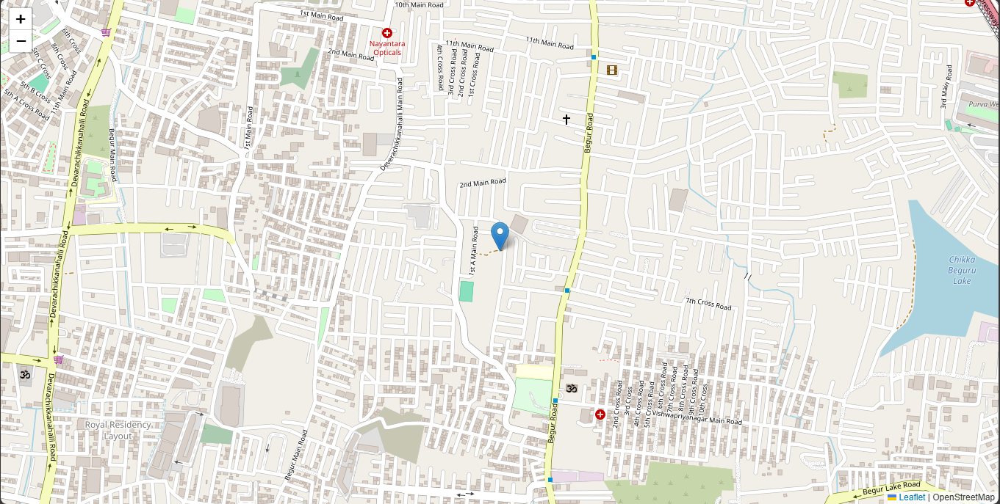
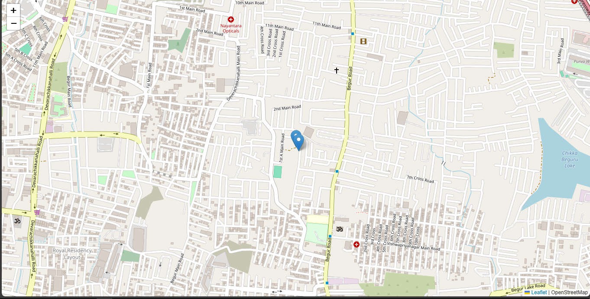

# Real-Time Location Tracker 📍

A real-time location tracking app built with Socket.IO to update a user’s current live location seamlessly and efficiently. This project is ideal for tracking and displaying the live location of individuals or devices on a web interface.

# Project Overview 🚀
 
The Real-Time Location Tracker leverages Socket.IO for instant, two-way communication between clients and the server. This enables real-time updates and is perfect for applications like live tracking for deliveries, events, or personal location sharing.

# Check it out 
https://realtime-tracker-q2o7.onrender.com/

when two connections are found 

